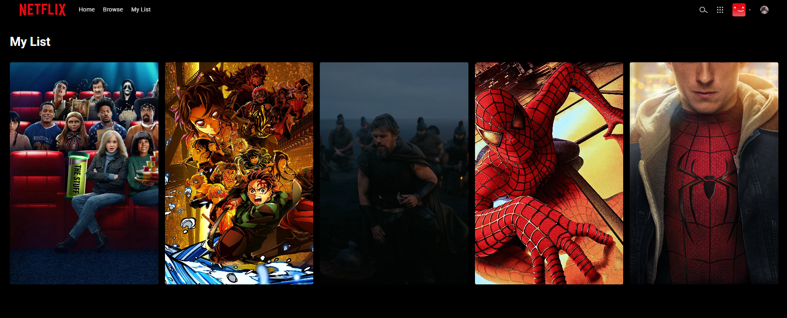

# 🎬 Netflix Clone

A modern **Netflix-inspired streaming web application** built with **React, Firebase, and the OMDb API**.

This project goes beyond a basic UI clone by implementing real user authentication, protected routes, a Netflix India-style landing page, cloud-synced watchlists, live movie search, movie details, and a responsive cinematic interface.

> **Disclaimer:** This project is created for educational and portfolio purposes. It is not affiliated with, endorsed by, or officially connected to Netflix, Inc.


<br>

## 📸 Screenshots

Landing Page 

 
Home Page 
 

Browse / Search 
 
Watchlist |
 

Login Page 
 

<br/>
---
## ✨ Features

### 🎯 Landing & Authentication

- Netflix India-inspired landing page
- Cinematic hero section with CTA
- "More reasons to join" feature cards
- Interactive FAQ accordion
- Netflix-style login and registration screens
- Email/password authentication using Firebase
- Form validation and authentication error handling

### 🔐 Authentication & Route Protection

- Firebase Authentication integration
- Protected application routes
- Unauthenticated users are restricted to public/authentication pages
- Authenticated users can access:
  - `/home`
  - `/browse`
  - `/watchlist`
- Secure sign-out functionality

### 🎥 Home & Movie Discovery

- Netflix-style hero/banner section
- Movie rating and match indicators
- Play trailer and More Info actions
- Horizontally scrollable movie rows
- Curated categories including:
  - Trending
  - Top Rated
  - Action
  - Comedy
- Responsive movie cards
- Loading skeleton states

### 🔎 Live Search

- Real-time movie and series search
- Search powered by the OMDb API
- Responsive grid-based search results
- Movie discovery through the Browse page

### ❤️ My List / Watchlist

- Add movies to your personal watchlist
- Remove movies from the watchlist
- Watchlist data stored in Firebase Cloud Firestore
- Watchlist is maintained separately for each authenticated user
- Real-time cloud synchronization

### 🎬 Movie Details

Each movie can be opened in a detailed modal containing:

- High-resolution poster
- IMDb rating
- Cast
- Runtime
- Genre
- Plot overview
- Trailer action
- Watchlist toggle

### 🎨 UI & User Experience

- Netflix-inspired cinematic design
- Animated splash screen
- Interactive navigation bar
- Expandable search bar
- Profile/account dropdown
- Responsive layout for mobile, tablet, and desktop
- Custom hidden scrollbars for movie carousels
- Gradient overlays and cinematic visual effects

---

## 🛠️ Tech Stack

| Category | Technology |
|---|---|
| Frontend | React 19 |
| Build Tool | Vite 8 |
| Styling | Tailwind CSS v4 |
| Authentication | Firebase Authentication |
| Database | Firebase Cloud Firestore |
| Movie Dataset | Local curated dataset |
| Live Search | OMDb API |
| Routing | React Router DOM v7 |

---

## 📁 Project Structure

```text
src/
├── assets/
│   └── SVGs, icons, Netflix logos, and avatars
│
├── components/
│   ├── Banner.jsx
│   ├── MovieCard.jsx
│   ├── MovieModal.jsx
│   ├── MovieRow.jsx
│   ├── Navbar.jsx
│   ├── ProtectedRoute.jsx
│   ├── SkeletonCard.jsx
│   └── SplashScreen.jsx
│
├── context/
│   └── AuthContext.jsx
│
├── data/
│   └── movies.json
│
├── pages/
│   ├── Browse.jsx
│   ├── Home.jsx
│   ├── Landing.jsx
│   ├── Login.jsx
│   ├── Signup.jsx
│   └── Watchlist.jsx
│
└── services/
    ├── firebase.js
    ├── omdbApi.js
    └── watchlistService.js
```

### Component & Module Responsibilities

| File | Responsibility |
|---|---|
| `Banner.jsx` | Displays the main hero banner and movie actions |
| `MovieCard.jsx` | Renders individual movie posters |
| `MovieModal.jsx` | Displays movie details and watchlist actions |
| `MovieRow.jsx` | Creates horizontally scrollable movie categories |
| `Navbar.jsx` | Handles navigation, search, profile menu, and sign-out |
| `ProtectedRoute.jsx` | Restricts application routes to authenticated users |
| `SkeletonCard.jsx` | Displays loading placeholders |
| `SplashScreen.jsx` | Displays the Netflix-style intro animation |
| `AuthContext.jsx` | Provides authentication state throughout the application |
| `movies.json` | Stores curated movie data for home categories |
| `firebase.js` | Initializes Firebase Authentication and Firestore |
| `omdbApi.js` | Handles OMDb API requests and movie data processing |
| `watchlistService.js` | Handles Firestore watchlist CRUD operations |

---

## 🚀 Getting Started

### Prerequisites

Make sure you have the following installed:

- Node.js
- npm
- A Firebase account
- An OMDb API key

---

### 1. Clone the Repository

```bash
git clone https://github.com/divyaa224/netflix-clone.git
cd netflix-clone
```

---

### 2. Install Dependencies

```bash
npm install
```

---

### 3. Configure Firebase

1. Open the [Firebase Console](https://console.firebase.google.com/).
2. Create a new Firebase project.
3. Go to **Build → Authentication**.
4. Enable **Email/Password** authentication.
5. Go to **Build → Firestore Database**.
6. Create a Firestore database.
7. Open **Project Settings → Your Apps**.
8. Create/configure a Web App.
9. Copy the Firebase configuration values.

---

### 4. Get an OMDb API Key

Create an API key from the [OMDb API website](https://www.omdbapi.com/apikey.aspx).

The key is required for live movie and series search.

---

### 5. Configure Environment Variables

Create a `.env` file in the project root:

```env
VITE_FIREBASE_API_KEY=your_firebase_api_key
VITE_FIREBASE_AUTH_DOMAIN=your_project.firebaseapp.com
VITE_FIREBASE_PROJECT_ID=your_project_id
VITE_FIREBASE_STORAGE_BUCKET=your_project.appspot.com
VITE_FIREBASE_MESSAGING_SENDER_ID=your_sender_id
VITE_FIREBASE_APP_ID=your_app_id

VITE_OMDB_API_KEY=your_omdb_api_key
```

> **Security:** Never commit your `.env` file or expose private API credentials in the repository.

---

### 6. Start the Development Server

```bash
npm run dev
```

The application will be available at:

```text
http://localhost:5173
```

---

## 🔥 Application Flow

```text
User
 │
 ├── Landing Page
 │      │
 │      ├── Login
 │      └── Sign Up
 │
 └── Firebase Authentication
          │
          ├── Home
          │    ├── Hero Banner
          │    ├── Trending
          │    ├── Top Rated
          │    ├── Action
          │    └── Comedy
          │
          ├── Browse
          │    └── OMDb Live Search
          │
          └── My List
               │
               └── Firebase Firestore
```

### High-Level Data Flow

```text
Local Curated Dataset
        │
        ▼
     Home Page
        │
        ▼
   Movie Cards
        │
        ├──────────────► Movie Details Modal
        │                         │
        │                         ▼
        │                    Add / Remove
        │                         │
        │                         ▼
        │                    Firestore
        │
        └──────────────► Browse / Search
                                  │
                                  ▼
                              OMDb API
```

---

## 🗄️ Firestore Data Structure

Each authenticated user's watchlist is stored under their Firebase user ID.

```text
users/
└── {userId}/
    └── watchlist/
        └── {imdbID}/
            ├── imdbID
            ├── Title
            ├── Year
            ├── Poster
            ├── imdbRating
            ├── Genre
            ├── Plot
            └── addedAt
```

### Watchlist Fields

| Field | Description |
|---|---|
| `imdbID` | Unique IMDb movie/series identifier |
| `Title` | Movie or series title |
| `Year` | Release year |
| `Poster` | Poster image URL |
| `imdbRating` | IMDb rating |
| `Genre` | Movie/series genre |
| `Plot` | Short plot description |
| `addedAt` | Date/time when the item was added |

---

## 🔐 Firestore Security Rules

Use the following rules so that authenticated users can only read and modify their own watchlist:

```text
rules_version = '2';

service cloud.firestore {
  match /databases/{database}/documents {

    match /users/{userId}/watchlist/{movieId} {
      allow read, write:
        if request.auth != null
        && request.auth.uid == userId;
    }
  }
}
```

This prevents one authenticated user from accessing another user's watchlist.

---

## 🧭 Application Routes

| Route | Purpose | Access |
|---|---|---|
| `/` | Netflix-style landing page | Public |
| `/login` | User login | Public |
| `/signup` | User registration | Public |
| `/home` | Main movie dashboard | Protected |
| `/browse` | Movie search and discovery | Protected |
| `/watchlist` | User's saved movies | Protected |

---

## 🧩 Key Functional Modules

### Authentication

Firebase Authentication manages user registration, login, authentication state, and sign-out.

### Movie Data

The Home page uses a curated local movie dataset, while the Browse page uses the OMDb API for live search.

### Watchlist

The watchlist is connected to Firestore and scoped to the currently authenticated Firebase user.

### Protected Routes

`ProtectedRoute.jsx` prevents unauthenticated users from directly accessing protected application pages.

### Responsive UI

The interface is designed to work across desktop, tablet, and mobile screen sizes.

---

## 🗺️ Roadmap

### Completed

- [x] Netflix India-style landing page
- [x] Interactive FAQ accordion
- [x] Reasons-to-join feature cards
- [x] Netflix-style login page
- [x] Netflix-style sign-up page
- [x] Firebase authentication
- [x] Protected routes
- [x] Cloud watchlist integration
- [x] Firestore user-specific watchlists
- [x] Live OMDb movie search
- [x] Movie details modal
- [x] Responsive layout
- [x] Splash screen animation

### Planned

- [ ] YouTube trailer auto-play inside the movie modal
- [ ] Genre filtering on the Browse page
- [ ] Continue Watching functionality
- [ ] Local playback progress tracking
- [ ] Mobile touch gestures for horizontal movie carousels

---

## 🔮 Future Improvements

Potential improvements for future versions include:

- Personalized movie recommendations
- Continue Watching synchronization
- Multiple user profiles
- Advanced genre and language filters
- Search history
- Recently viewed movies
- Better trailer integration
- Pagination/infinite scrolling for search results
- Improved accessibility
- Production deployment and CI/CD
- Performance optimization and lazy loading

---

## ⚠️ Important Notes

- The project uses Netflix-inspired design concepts for educational purposes.
- Netflix branding, names, and related assets belong to Netflix, Inc.
- This application is not affiliated with or endorsed by Netflix.
- OMDb API availability and request limits depend on the API provider.
- Firebase configuration must be supplied through environment variables.

---

## 👨‍💻 Creator

Built by **[divyaa224](https://github.com/divyaa224)**.

---

## 📄 License

This project is intended for **educational and portfolio purposes only**.

Netflix and all related trademarks, branding, and assets belong to their respective owners.

---

<p align="center">
  Built with React, Firebase, and OMDb API ❤️
</p>
